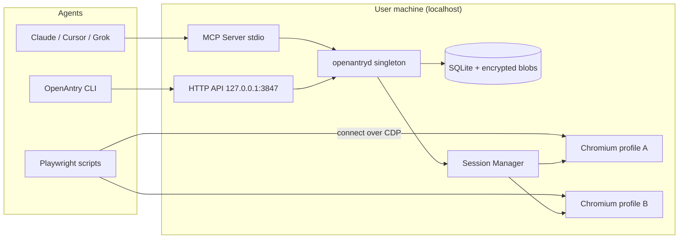
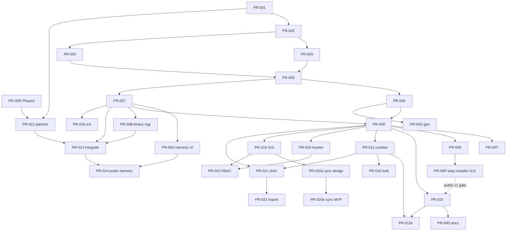

# OpenAntry Design Document

**Local-first, agent-first open-source antidetect browser platform**

| Field | Value |
| --- | --- |
| **Document title** | OpenAntry Architecture & Product Design |
| **Product name** | OpenAntry (working name; alternatives considered: ProfileForge, AgentBrowser, ShadowProfile) |
| **Author** | OpenAntry maintainers (placeholder) |
| **Date** | 2026-08-10 |
| **Revised** | 2026-08-10 (revision 4 — easy installer is a hard product requirement) |
| **Status** | Draft (revision 4) |
| **Workspace** | `C:\Users\logan\money_sites\opensource-no-detect-browser-for-agents` (greenfield) |
| **Audience** | Senior engineers implementing the monorepo |

---

## Overview

Commercial antidetect browsers (AdsPower, Multilogin, Dolphin{anty}, GoLogin, Incogniton, BitBrowser) are optimized for human operators managing multi-account workflows through desktop UIs. AI agents need the inverse: a **programmable, local, isolated browser runtime** with structured session lifecycle, fingerprint-coherent profiles, proxy alignment, and first-class CDP/Playwright connectivity—exposed primarily through **MCP tools** and a local API, not a GUI.

**OpenAntry** is a local-first, open-source platform that:

1. Runs a **core daemon** on the user’s machine managing encrypted profile secrets, fingerprint generation, proxies, and browser processes.
2. Exposes an **agent-first surface**: MCP server, OpenAPI REST (with optional AdsPower-compatible shims), CLI, and CDP WebSocket URLs for every live session.
3. Provides a **thin desktop GUI** (Tauri 2) as a secondary client over the same API.
4. Uses a **fingerprint consistency engine** plus a **patched Chromium distribution** (gated on Phase 0 exit) so generated identities are internally coherent and harder to flag than pure JS stealth.
5. Ships with an **easy installer** for non-developers: one download, guided setup, daemon + CLI on PATH, browser acquisition, MCP config helper—not “clone repo and cargo build” as the primary path.

**MVP path:** Phase 1 ships a complete profile/session/MCP stack on **stock Chromium/Chrome** (or user-supplied path) with coherent fingerprint *documents* and launch wiring. **Stealth claims and default patched binary** require Phase 0 go/no-go exit. See [Chromium OSS delivery model](#chromium-oss-delivery-model) and [Assumptions & feasibility](#assumptions--feasibility).

**Install path (product requirement):** The primary user experience for v1 public release is an **easy platform installer** (Windows first, then macOS/Linux). Source/`cargo install` remains a developer path only. See [Installation & Distribution Requirements](#installation--distribution-requirements) and goal **G11**.

This document defines competitive positioning, full feature catalog, system architecture, fingerprint engine design, full API contracts, phased delivery, key decisions, and an ordered PR plan for incremental greenfield implementation.

---

## Assumptions & Feasibility

| Assumption | Value |
| --- | --- |
| Team | 2–3 full-time engineers (or equivalent) for core path; browser patching may need 1 dedicated owner |
| Calendar (order of magnitude) | Phase 0: 4–8 weeks; Phase 1 (daemon+MCP on stock browser): 8–12 weeks; Phase 2 (FP depth + patches integration): 12–20 weeks; Phase 3 GUI: +8–12 weeks |
| CI budget | Self-hosted or paid runners for Chromium; GitHub-hosted OK for daemon. Estimate multi-hour builds, multi-tens-of-GB disk per OS image |
| v1 OS ship order | **Linux x64 first** (CI + primary dev), then **Windows x64**, then **macOS** (arm64+x64). G10 is staggered, not day-1 simultaneous |
| MVP stealth bar | Automation markers green (`webdriver` false, no HeadlessChrome UA, `window.chrome` present); internal consistency validator green; CreepJS/BrowserLeaks automation sections improved vs stock Playwright. Full canvas/WebGL commercial parity may lag Phase 2 |
| Funding / infra | No cloud control plane cost; browser build farm is the main non-dev cost |

---

## Background & Motivation

### Current state of the market

Antidetect browsers solve **profile isolation + fingerprint spoofing + proxy binding** so operators can run many browser identities without cookie/storage cross-contamination and with less bot-score risk. They typically ship:

- Custom Chromium/Firefox engines (SunBrowser, Mimic, Orbita, Stealthfox, etc.)
- 20–55+ tunable fingerprint parameters
- Local APIs for Selenium/Puppeteer/Playwright
- Team/cloud sync, RPA builders, synchronizers

Open-source stealth tooling has matured in parallel:

| Project | Approach | Gap vs commercial antidetect |
| --- | --- | --- |
| **CloakBrowser** | Source-level Chromium C++ patches; Playwright drop-in | Automation binary focus; proprietary binary license; not a profile-manager product; concurrency gated commercially |
| **Camoufox** | Firefox C++ fingerprint injection + BrowserForge stats | Firefox TLS/shape differs from Chrome; no full multi-profile product shell |
| **Patchright** | Playwright fork reducing CDP handshake leaks | Still needs a real browser identity layer |
| **puppeteer-extra-stealth / undetected-chromedriver / nodriver** | JS/driver-level patches | Fragile against modern detectors; no profile store |
| **GoLogin MCP** | Commercial MCP over cloud/local profiles | Closed source; cloud-centric; rate limits; not local-first OSS |

### Pain points this project addresses

1. **Agent UX is second-class.** Most products bolt API/MCP onto a GUI-first product. Agents need structured outputs (`cdp_ws_url`, connect snippets, heartbeat, typed errors).
2. **Local-first privacy.** Cloud profile sync is convenient but creates exfiltration and ToS surface; many power users want encrypted-at-rest local secrets only.
3. **Fingerprint inconsistency.** Randomizing parameters independently produces impossible combos (Windows UA + Apple GPU, mobile screen + desktop hardwareConcurrency). Commercial tools hide this; OSS scripts often do not.
4. **JS stealth is insufficient alone.** Detection now scores session realism (TLS/JA3/JA4, CDP artifacts, canvas/WebGL coherence). Source-level patches are required for serious targets.
5. **No complete OSS “AdsPower-class” stack** that combines profile CRUD, proxies, cookies, extensions, MCP, and patched engine under a permissive product architecture.

### Intended legitimate uses

- Multi-account management for **owned** businesses and brands
- Ad creative / landing-page QA across locales and devices
- Privacy research and fingerprint measurement
- Agent browser automation with strong session isolation
- Lawful data collection / scraping where permitted by law and site terms

**Not intended for:** fraud, credential stuffing, unauthorized account takeover, or evasion of law-enforcement systems. See [Responsible Use](#responsible-use--ethics).

---

## Goals & Non-Goals

### Goals (v1 = Phases 0–2 complete)

| ID | Goal |
| --- | --- |
| G1 | Local daemon with encrypted sensitive fields at rest (SQLite + field/blob encryption; full dir archive encryption P1) |
| G2 | Profile CRUD with coherent fingerprint generation and typed manual overrides |
| G3 | Launch/stop sessions exposing CDP WebSocket URLs (exclusive one session per profile) |
| G4 | First-class MCP server with structured JSON tool results |
| G5 | Local REST API + OpenAPI; CLI parity for core operations |
| G6 | Per-profile HTTP(S)/SOCKS5 proxy + exit-IP check + geo/timezone/language alignment |
| G7 | Cookie import/export; basic extension install per profile |
| G8 | Automated fingerprint health checks (internal suite P0 post-session; public detectors P1) |
| G9 | Bind to `127.0.0.1` by default; explicit opt-in for LAN; token auth default |
| G10 | Daemon + browser support for Win/macOS/Linux **staggered** (Linux → Windows → macOS) |
| **G11** | **Easy installer as primary install path** — non-developers install OpenAntry with a double-click / guided wizard; no Rust toolchain required; post-install can run daemon, CLI, and MCP within minutes |

### Non-goals (v1 / explicit deferrals)

| ID | Non-goal |
| --- | --- |
| NG1 | Built-in residential proxy marketplace |
| NG2 | Cloud phones / real IMEI Android devices |
| NG3 | Multi-tenant SaaS control plane |
| NG4 | Full visual RPA builder parity with AdsPower/Dolphin (Phase 3+) |
| NG5 | Marketing or tooling designed for fraud |
| NG6 | Shipping proprietary third-party binaries (e.g. CloakBrowser commercial binary) as the default engine |
| NG7 | Perfect undetectability guarantees (impossible; we optimize pass rates and coherence) |
| NG8 | Forking BoringSSL / custom TLS stacks that diverge JA3/JA4 from upstream Chromium |
| NG9 | AdsPower cloud team APIs, billing portals, or non-local service API keys |
| NG10 | Requiring end users to build from source or install a Rust toolchain to use OpenAntry |

### MVP stealth bar (acceptance)

| Check | Required for “stealth MVP” messaging |
| --- | --- |
| `navigator.webdriver === false` | Yes (Phase 0/1 patch or engine) |
| No `HeadlessChrome` in UA when headed/headless patched | Yes |
| `window.chrome` present | Yes |
| Fingerprint document consistency validator passes | Yes |
| Internal host-leak checks documented (pass or known fail) | Yes |
| Canvas/WebGL match commercial tools on Pixelscan/CreepJS | **No** — Phase 2 target |
| JA3 identical to same-major Chrome | Yes via **upstream Chromium TLS, no custom stack** |

---

## Competitive Feature Matrix

Legend: **Y** = supported, **P** = partial / limited, **N** = no / not core, **—** = unknown/N/A.  
**OpenAntry** columns: **v1** (Phases 0–2) and **later** (Phases 3–4+).

> **Footnote:** Competitor cells are **best-effort from public product docs/marketing as of 2026-08**, not lab-verified. Param counts (e.g. Multilogin “55+”) may be marketing-inflated. OpenAntry **Y (core)** for consistency means *open constraint rules + reject-on-inconsistent + health harness*, not that competitors have zero consistency logic.

### Core product & platforms

| Feature | AdsPower | Multilogin | Dolphin{anty} | GoLogin | Incogniton | BitBrowser | OpenAntry v1 | OpenAntry later |
| --- | --- | --- | --- | --- | --- | --- | --- | --- |
| Desktop app (Win/macOS/Linux) | Y | Y | Y | Y | Y | Y | P (daemon+CLI; GUI Phase 3) | Y |
| **Easy / one-click installer** | Y | Y | Y | Y | Y | Y | **Y (v1 requirement)** | Y |
| Local-first storage default | P | P | P | P | Y | P | Y | Y |
| Cloud profile sync | Y | Y | Y | Y | P | Y | N | P (optional) |
| Dual engines (Chrome + Firefox) | Y | Y | N (Chrome) | N (Orbita) | N | P | N (Chromium) | P (Camoufox optional) |
| Custom / patched browser engine | Y | Y | Y | Y (Orbita) | Y | Y | P→Y (Phase 0 gate) | Y |
| Kernel update model | Custom fork lag | Custom lag | Custom lag | Orbita lag | Custom lag | Custom lag | ≤2 major lag policy | same |
| Free tier (SaaS) | Trial/paid | Trial/paid | Free tier ~5–10 | Free ~3 profiles | Free tier | Low-cost | N/A | N/A |
| Open-source product | N | N | N | N | N | N | **Y** | Y |
| Agent-first MCP | N | N | N | Y (bolted MCP) | N | N | **Y (primary)** | Y |
| Local REST API maturity | Strong (port 50325) | Strong | Strong | Strong | Y | Y | Y (native OpenAPI) | Y + AdsPower shim |
| AdsPower Local API portable | Native | — | — | — | — | — | P (shim subset) | Y |
| Playwright/Puppeteer/Selenium | Y | Y | Y | Y | Y (CDP) | Y | Y (CDP-first) | Y |
| Headless mode | P | Y | P | Y | P | P | Y | Y |
| Default concurrent session caps | License-tiered | License-tiered | License-tiered | License-tiered | Tiered | Tiered | Config default 5 | same |
| Profile export / machine transfer | Y | Y | Y (transfer) | Y | P | P | Y (`.OpenAntry`) | Y + competitor import |
| Team RBAC / folders / audit | Y | Y | Y | Y | P | P | N | Y (local multi-user) |
| Price model | Paid SaaS | Paid SaaS | Freemium | Freemium | Freemium | Low-cost | Free OSS | Free OSS |

### Fingerprint & isolation

| Feature | AdsPower | Multilogin | Dolphin | GoLogin | Incogniton | BitBrowser | OpenAntry v1 | later |
| --- | --- | --- | --- | --- | --- | --- | --- | --- |
| Tunable FP params count | 20–50+ | 55+ | ~20 | High | High | High | 25+ core | 50+ |
| Auto “new fingerprint” | Y | Y | Y (1-click real) | Y | Y | Y | Y | Y |
| Consistency engine (OS↔UA↔GPU…) | P | Y | Y | Y | P | P | **Y (open rules + reject)** | Y |
| User-Agent + Client Hints | Y | Y | Y | Y | Y | Y | Y | Y |
| Timezone / locale / languages | Y | Y | Y | Y | Y | Y | Y | Y |
| Screen / DPR / color depth | Y | Y | Y | Y | Y | Y | Y | Y |
| hardwareConcurrency / deviceMemory | Y | Y | Y | Y | Y | Y | Y | Y |
| Canvas noise | Y | Y | Y | Y | Y | Y | Y | Y |
| WebGL vendor/renderer | Y | Y | Y (enhanced) | Y | Y | Y | Y | Y |
| WebGPU spoof | P | P | Y | P | P | P | P | Y |
| AudioContext | Y | Y | Y | Y | Y | Y | Y | Y |
| Fonts enumeration | Y | Y | Y | Y | Y | Y | Y (set_id + engine enforce) | Y |
| ClientRects | Y | Y | Y | Y | Y | Y | P | Y |
| Speech voices | Y | Y | Y | Y | Y | Y | P | Y |
| Media devices | Y | Y | Y | Y | Y | Y | P | Y |
| WebRTC IP control | Y | Y | Y | Y | Y | Y | Y | Y |
| Do Not Track / MAC spoof | Y | Y | P | P | P | P | P | Y |
| Mobile FP (Android/iOS) | Y | Y + cloud phones | P | P (mobile beta) | P | Y | P (UA only) | P |
| Cloud phones / real IMEI | N | Y | N | N | N | N | N | N (NG) |
| Profile storage isolation | Y | Y | Y | Y | Y | Y | Y | Y |
| Trash / restore profiles | Y | P | P | P | P | P | P | Y |
| Cookie robot | Y | Y | Y | Y | Y (collector) | Y | N (P2) | Y |

### Network, automation, ops

| Feature | AdsPower | Multilogin | Dolphin | GoLogin | Incogniton | BitBrowser | OpenAntry v1 | later |
| --- | --- | --- | --- | --- | --- | --- | --- | --- |
| HTTP(S) / SOCKS5 proxies | Y | Y | Y | Y | Y | Y | Y | Y |
| SSH tunnel proxy | Y | P | P | P | P | P | N | P |
| Built-in residential proxies | P | Y | P | Y | P | P | N | N (BYO) |
| Proxy check / exit IP | Y | Y | Y | Y | Y | Y | Y | Y |
| Geo align TZ/lang from IP | Y | Y | Y | Y | Y | Y | Y | Y |
| Cookie import-export | Y | Y | Y | Y | Y | Y | Y | Y |
| Bulk extension install | Y | Y | Y (shared) | Y | Y | Y | P | Y |
| Synchronizer (multi-window) | Y | P | Y (beta) | P | Y | P | N | Y |
| Visual RPA / scenarios | Y | P | Y | P | P | Y (RPA free) | N | Y |
| Human typing / mouse | P | Y | P | P | P | P | P (via Playwright) | Y |
| Bulk profile ops | Y | Y | Y | Y | Y | Y | Y | Y |
| Import from competitors | P | P | P | P | P | P | N | Y (AdsPower/Dolphin) |
| Platform credential vault | Y | Y (autofill) | P | Y | P | P | N | P |
| 2FA / IP whitelist (cloud) | Y | Y | Y | Y | P | P | N/A local | P |
| Fingerprint health harness | N | N | N | N | N | N | **Y** | Y |

### Differentiation summary

OpenAntry wins on **agent-first design (MCP primary), local-first encryption of secrets, open source, open consistency rules with reject-on-inconsistent, fingerprint health testing as a product feature, and an easy installer parity with commercial tools**. Competitors may implement proprietary consistency; OpenAntry differentiates by making rules, validation errors, and harness results agent-visible. It does **not** compete on cloud phones, proxy marketplaces, or enterprise cloud RBAC in v1. **Install must feel as easy as AdsPower/Dolphin** (download installer → wizard → ready), not like a Rust library.

**Migration driver:** AdsPower Local API (default `http://local.adspower.net:50325` / localhost) is widely scripted; OpenAntry’s optional shim lowers switching cost (see [AdsPower shim endpoint matrix](#adspower-local-api-shim-endpoint-matrix)).

---

## Full Feature Catalog

**Priority ↔ phase mapping:**

| Tag | Phase | Meaning |
| --- | --- | --- |
| **P0** | Phase 1 | MVP daemon path (may use stock browser) |
| **P1** | Phase 2 | Full fingerprint surfaces, proxy depth, cookies/extensions, public detector harness |
| **P2** | Phase 3 | Desktop GUI, synchronizer MVP, scenarios |
| **P3** | Phase 4+ | Team local RBAC, competitor import, polish |

### Profiles & storage

| ID | Feature | Priority |
| --- | --- | --- |
| F-001 | Profile entity (id, name, tags, notes, created/updated) | P0 |
| F-002 | Fingerprint config blob (versioned schema `fingerprint.schema.json` v1) | P0 |
| F-003 | Per-profile user-data directory | P0 |
| F-004 | P0: encrypt fingerprint, proxy secrets, cookie blobs; P1: full profile archive at rest | P0/P1 |
| F-005 | SQLite metadata DB with migrations (expand-contract) | P0 |
| F-006 | Soft-delete (trash) + restore | P1 |
| F-007 | Folders / groups | P2 |
| F-008 | Tags, search, filters | P1 |
| F-009 | Bulk create / delete / clone | P1 |
| F-010 | Export/import profile package (`.OpenAntry` archive) | P1 |
| F-011 | Import from AdsPower / Dolphin export formats | P3 |
| F-012 | Optional cloud sync (out of band; design-only for v1) | P3 |

### Fingerprint engine

| ID | Feature | Priority |
| --- | --- | --- |
| F-020 | Coherent fingerprint generator (OS seed → dependent fields) | P0 |
| F-021 | Typed partial overrides with post-validate | P0 |
| F-022 | UA + Sec-CH-UA bound to **packaged browser major** at launch | P0 |
| F-023 | Timezone, locale, languages | P0 |
| F-024 | Screen geometry + devicePixelRatio | P0 |
| F-025 | hardwareConcurrency, deviceMemory, maxTouchPoints | P0 |
| F-026 | Canvas 2D seeded noise (deterministic per profile) | P0 |
| F-027 | WebGL vendor/renderer/extensions | P0 (doc); engine force P0–P1 |
| F-028 | WebRTC policy (disable / public only / proxy) | P0 |
| F-029 | Fonts allowlist by OS family (**MVP: set_id required; engine enforce with patch**) | P0 |
| F-030 | AudioContext seeded noise | P1 |
| F-031 | ClientRects noise | P1 |
| F-032 | Speech synthesis voices | P1 |
| F-033 | Media devices enumerate spoof | P1 |
| F-034 | WebGPU adapter spoof | P2 |
| F-035 | Battery / Network Information handling | P2 |
| F-036 | Plugins / mimeTypes realism (**MVP minimal plugin list with webdriver patches**) | P0 |
| F-037 | Fingerprint templates | P0 |
| F-038 | Real-device sample library (statistical; collection policy required) | P2 |
| F-039 | Inconsistency detector + fix suggestions | P0 |

### Browser engine & sessions

| ID | Feature | Priority |
| --- | --- | --- |
| F-040 | Packaged patched Chromium (**gated on Phase 0**; stock/path works in P0 without stealth claims) | P0 path / P1 stealth default |
| F-041 | Session launch with fingerprint + optional proxy | P0 |
| F-042 | CDP debug port / WebSocket URL on 127.0.0.1 only | P0 |
| F-043 | Session stop / force-kill / crash detection / orphan reclaim | P0 |
| F-044 | Concurrent session caps + resource limits | P0 |
| F-045 | Heartbeat / session TTL / idle reclaim state machine | P0 |
| F-046 | Headless + headed modes (**default headed**) | P0 |
| F-047 | Crash recovery (restart with same profile) | P1 |
| F-048 | Automation leak patches | P0 |
| F-049 | Optional Firefox/Camoufox experimental backend | P1 experimental / P3 support |
| F-050 | Binary auto-update channel (daemon + browser) | P1 |
| F-051 | **Easy platform installers** (Windows MSI/setup, macOS DMG, Linux AppImage) as **primary** distribution | **P0** (public v1 release gate) |
| F-052 | Installer-driven first-run wizard (data dir, recovery key, API token, browser select/download) | **P0** |
| F-053 | Post-install PATH registration for `openantryd` / `OpenAntry` CLI | **P0** |
| F-054 | MCP config helper (generate Claude Desktop / Cursor / Grok snippet; optional one-click write) | **P0** |
| F-055 | Optional “Start OpenAntry at login” / tray helper (minimal; full GUI is Phase 3) | P1 |
| F-056 | Code-signed installers where certs available; SmartScreen/Gatekeeper guidance | P0/P1 |
| F-057 | In-app / CLI self-update of daemon installer channel | P1 |
| F-058 | Uninstaller that stops daemon, optional data-dir keep/delete | **P0** |

### Proxy & network

| ID | Feature | Priority |
| --- | --- | --- |
| F-060 | Per-profile HTTP / HTTPS / SOCKS5 | P0 |
| F-061 | Proxy auth | P0 |
| F-062 | Proxy check (exit IP, latency, country) | P0 |
| F-063 | Auto-align timezone/geo/language (new FP generation + audit) | P0 |
| F-064 | Bulk proxy import | P1 |
| F-065 | Proxy rotation hooks | P2 |
| F-066 | SSH tunnel support | P3 |

### Cookies, extensions, credentials

| ID | Feature | Priority |
| --- | --- | --- |
| F-070 | Cookie import (JSON Playwright shape / Netscape) | P0 |
| F-071 | Cookie export | P0 |
| F-072 | Cookie robot | P2 |
| F-073 | Extension install from CRX/path | P1 |
| F-074 | Shared extension set templates | P2 |
| F-075 | Password/credential vault | P3 |

### Agent interfaces

| ID | Feature | Priority |
| --- | --- | --- |
| F-080 | MCP server stdio (primary); optional streamable HTTP localhost | P0 |
| F-081 | MCP tools: profile + session lifecycle | P0 |
| F-082 | MCP tools: cookies, proxy (P0); fingerprint health public suites (P1) | P0/P1 |
| F-083 | Structured tool results with multi-lang connect docs | P0 |
| F-084 | REST API + OpenAPI 3 | P0 |
| F-085 | AdsPower-compatible endpoint subset | P2 |
| F-086 | CLI | P0 |
| F-087 | Agent skill docs (ship with MCP) | P0 |
| F-088 | gRPC optional | P3 |

### GUI & advanced automation

| ID | Feature | Priority |
| --- | --- | --- |
| F-090 | Tauri 2 desktop shell | P2 (Phase 3) |
| F-091 | Fingerprint editor UI | P2 |
| F-092 | Action synchronizer (click/scroll MVP) | P2 |
| F-093 | Visual scenario builder | P3 |
| F-094 | Scenario runner API/MCP | P2 |

### Quality, security, ops

| ID | Feature | Priority |
| --- | --- | --- |
| F-100 | Public detector harness (CreepJS, BrowserScan, …) | P1 |
| F-100a | Internal automation + consistency harness on stock/patched | P0 |
| F-101 | CI matrix for detector baselines | P1 |
| F-102 | Localhost-only bind default + Host allowlist | P0 |
| F-103 | Master key / OS keychain + recovery key at init | P0 |
| F-104 | Audit log (local) | P1 |
| F-105 | Local multi-user RBAC | P3 |
| F-106 | Telemetry opt-in only (off by default) | P1 |
| F-107 | Responsible use docs in product | P0 |

---

## Agent-First Architecture

### Design principle

> Every capability is available through MCP/API/CLI first. The GUI is a client. No feature ships GUI-only.

### Process topology



### Session lifecycle semantics

#### Exclusive lock

- **At most one running session per `profile_id`.**  
- Second `launch_session` → `SESSION_ALREADY_RUNNING` with existing `session_id` and `cdp_ws_url` if still live.  
- **Force takeover:** `launch_session({ force: true })` stops the prior session (graceful then kill), then starts.  
- No wait-queue in v1 (agents must stop or force).

#### Daemon singleton

- Pidfile: `{data_dir}/openantryd.pid` + lock on `{data_dir}/openantryd.lock`.  
- Second instance: exit `ALREADY_RUNNING` and print existing API base URL from `{data_dir}/daemon.json`.  
- Discovery: fixed default `http://127.0.0.1:3847`; override `OPENANTRY_API_BASE` / `daemon.json`.

#### Startup reconciliation

On daemon start:

1. Load `sessions` where `status IN ('starting','running','stopping')`.  
2. For each: if PID alive and listening on `debug_port` → mark `running`, refresh `cdp_ws_url` if needed.  
3. If PID dead or port dead → mark `crashed` or `stopped`, clear lock on profile.  
4. Scan port range for unexpected Chromium with OpenAntry user-data-dir markers; adopt or kill orphans per config (`OPENANTRY_ORPHAN_POLICY=kill|adopt|ignore`, default `kill`).

#### Port allocator

- Range: **9222–9321** (100 ports), configurable `OPENANTRY_CDP_PORT_RANGE`.  
- Bind **only** `127.0.0.1` (never `0.0.0.0` for CDP).  
- Algorithm: random free port in range → bind probe → retry up to 20; else `PORT_CONFLICT`.  
- Exhaustion → `RESOURCE_LIMIT`.

#### TTL / idle reclaim state machine

```
starting → running → stopping → stopped
                ↘ crashed
running + (now > expires_at) + no heartbeat extension → reclaim_pending → stopping
```

- Default `ttl_seconds`: 3600; heartbeat extends by `ttl_seconds` from now (cap max session 24h).  
- Optional daemon CDP ping every 60s (`Browser.getVersion`); if CDP dead → `crashed`.  
- Reclaim **does** kill browser mid-Playwright; error code on next tool call: `SESSION_EXPIRED`.  
- Grace: 15s SIGTERM/taskkill then force.

#### CDP security (residual risk)

| Threat | Severity | Mitigation |
| --- | --- | --- |
| Any local process attaches to CDP and steals cookies | **High** (inherent to CDP) | Document residual risk; bind 127.0.0.1 only; short-lived sessions; never LAN-expose CDP; optional OS user isolation guidance |
| Port scan of 9222–9321 | Medium | Random ports; do not print ports to world-readable logs without redaction flag |
| Cross-profile CDP misuse | Medium | Enforce session→profile map; no API to list raw ports without auth token |

There is **no** cryptographic CDP auth in Chromium’s remote debugging; treat local multi-user machines as out-of-scope for strong isolation until Phase 4 OS-user separation.

#### Profile directory crypto states

```mermaid
stateDiagram-v2
  [*] --> Locked: daemon idle / after stop
  Locked --> Unlocking: launch_session
  Unlocking --> UnlockedForSession: unwrap DEK + load secrets; ensure user-data-dir exists
  UnlockedForSession --> Flushing: stop_session / reclaim
  Flushing --> Locked: re-encrypt sensitive blobs + fsync
  Flushing --> Corrupt: I/O failure
  Corrupt --> Locked: quarantine + CORRUPT_PROFILE error
  UnlockedForSession --> CrashedOpen: daemon crash
  CrashedOpen --> Unlocking: reconcile + recover or quarantine
```

**State semantics (P0 vs P1):**

| State / action | P0 behavior | P1+ (full archive encryption) |
| --- | --- | --- |
| **Locked** | Profile secrets (FP ciphertext, proxy ciphertext, `cookies_blob`) encrypted; **user-data-dir is plaintext on disk** if it already exists | user-data-dir may be stored as encrypted archive when no session holds the profile |
| **Unlocking** | Unwrap DEK; decrypt FP/proxy/cookies into memory; **ensure `data_path` directory exists** (create empty if needed). Do **not** “decrypt an entire browser tree” | Additionally extract/decrypt archive into `data_path` if present |
| **UnlockedForSession** | Browser process uses plaintext `user-data-dir`; secrets held in daemon memory for apply path | Same |
| **Flushing** | On stop: harvest cookies via CDP → update encrypted `cookies_blob`; re-encrypt any dirty secret blobs; fsync. user-data-dir left as-is on disk | Optionally re-pack and encrypt full dir archive after stop |
| **Corrupt** | Quarantine profile; `CORRUPT_PROFILE` | Same |

- Concurrent second open of same profile dir is prevented by exclusive session lock + filesystem lockfile `profile.lock`.  
- **Do not** implement full-dir decrypt in P0; “materialize archive” is P1-only wording.

### Standard result envelope

**Base fields (all tools):**

```json
{
  "ok": true,
  "error": null,
  "request_id": "req_..."
}
```

**Per-tool response types** are defined under [Named response types](#named-response-types-v1). Profile-only tools **omit** `session_id` / `cdp_ws_url`.

**Typed error codes:** `PROFILE_NOT_FOUND`, `SESSION_NOT_FOUND`, `SESSION_ALREADY_RUNNING`, `SESSION_EXPIRED`, `PORT_CONFLICT`, `PROXY_DEAD`, `PROXY_AUTH_FAILED`, `FINGERPRINT_INCONSISTENT`, `BINARY_MISSING`, `BINARY_MAJOR_MISMATCH`, `RESOURCE_LIMIT`, `STORAGE_LOCKED`, `CORRUPT_PROFILE`, `COOKIES_PARTIAL`, `COOKIES_APPLY_FAILED`, `UNAUTHORIZED`, `UNAUTHORIZED_BIND`, `ALREADY_RUNNING`, `INTERNAL`.

### Example agent workflow

**Goal:** “Spin up 5 isolated US browsers and scrape public product pages.”

1. `create_profile` ×5 with `template=win11_chrome_mid`, tags `["batch-2026-08-10"]`.  
2. `apply_proxy` each with distinct SOCKS5; `align_geo=true` (rewrites FP generation).  
3. Optionally `import_cookies` (writes encrypted blob; applied on next launch via CDP).  
4. `launch_session` ×5 (`headed=true` default) — daemon applies pending cookies **before** returning `cdp_ws_url`.  
5. Connect via CDP in JS or Python.  
6. `export_cookies` with `session_id` (live CDP harvest) if needed; `stop_session` ×5.

Skill doc: `docs/skills/multi-session-scrape.md` (ships with MCP PR).

---

## Appendix: API Contracts v1

### ProxyConfig

```json
{
  "$id": "OpenAntry.ProxyConfig",
  "type": "object",
  "required": ["server"],
  "properties": {
    "server": {
      "type": "string",
      "description": "Proxy URL: http://host:port | https://host:port | socks5://host:port"
    },
    "username": { "type": "string" },
    "password": { "type": "string" },
    "check_timeout_ms": { "type": "integer", "default": 8000, "minimum": 1000, "maximum": 60000 },
    "check_url": {
      "type": "string",
      "description": "Optional override IP-echo URL; must be in daemon allowlist unless OpenAntry_ALLOW_CUSTOM_CHECK_URL=1"
    }
  },
  "additionalProperties": false
}
```

### ProxyCheckResult

```json
{
  "ok": true,
  "exit_ip": "203.0.113.10",
  "country": "US",
  "region": "NY",
  "city": null,
  "timezone_guess": "America/New_York",
  "latency_ms": 84,
  "checked_at": "2026-08-10T12:00:00Z",
  "source": "ip_echo+offline_tz_map"
}
```

### Cookie object (Playwright-compatible)

```json
{
  "name": "session",
  "value": "…",
  "domain": ".example.com",
  "path": "/",
  "expires": -1,
  "httpOnly": true,
  "secure": true,
  "sameSite": "Lax",
  "partitionKey": null
}
```

`import_cookies` accepts:

```json
{
  "profile_id": "prf_…",
  "cookies": [ "/* Cookie[] */" ],
  "format": "playwright",
  "session_id": null,
  "merge": true
}
```

- `format`: `playwright` (default) | `netscape`  
- `session_id` optional: if set, also apply warm to that live session (see cookie algorithm below)  
- `merge`: `true` (default) merges by `(name, domain, path, partitionKey)`; `false` replaces entire pending blob  

### Cookie import/export algorithm (v1 normative)

**Non-goal:** reading/writing Chromium’s on-disk `Cookies` SQLite directly (format/version fragile across majors).

#### Storage

| Artifact | Location | Encryption |
| --- | --- | --- |
| Pending / last-known cookie set | Profile `cookies_blob` (ciphertext via libsodium) | P0 required |
| Live browser cookies | Chromium process memory + its user-data-dir (opaque to OpenAntry) | OS/browser |

#### Import

1. Validate each cookie: required `name`, `value`, `domain`; normalize `sameSite` to `Strict|Lax|None`; drop entries with `expires` in the past (count as `skipped_expired`).  
2. `partitionKey`: accept Playwright partition shape if present; pass through to CDP when supported; if CDP rejects → per-cookie error (do not fail whole batch unless all fail).  
3. Write merged/replaced set to encrypted **`cookies_blob`**; set `cookies_pending_apply=true` on profile metadata.  
4. **Warm path** (optional `session_id` or import during running session): after blob write, apply via CDP (step below).  
5. **Cold path** (no session): stop after blob write; browser is **not** updated until next `launch_session`.

#### Apply to browser (CDP)

Used on:

- Every successful `launch_session` **after** DevTools is reachable and **before** returning `cdp_ws_url` to the client.  
- Optional warm `import_cookies` when `session_id` is set.

Order:

1. Connect daemon CDP client to browser.  
2. If `OPENANTRY_EXPERIMENTAL_JS_STEALTH` and stock: install init script (once).  
3. For each cookie in pending blob: `Network.setCookie` (or `Storage.setCookies` batch where available).  
4. **Do not** navigate to `start_url` until cookie apply finishes (or fails).  
5. If `start_url` set: navigate after cookies.  
6. Clear `cookies_pending_apply` only if apply fully succeeded; on partial success keep flag and return `COOKIES_PARTIAL`.  
7. Only then return `SessionResult` / finish import response.

Partial failure → HTTP/MCP `ok: false` or `ok: true` with warnings policy:

- Prefer **`ok: false`**, code `COOKIES_PARTIAL`, body lists `applied`, `failed[]` with `{ index, name, domain, reason }`, blob still updated so retry is possible.  
- Total CDP failure → `COOKIES_APPLY_FAILED` (session may still be running; agent can retry import warm).

#### Export

| Call shape | Source | Behavior |
| --- | --- | --- |
| `export_cookies({ profile_id, session_id })` | **Live CDP** `Network.getAllCookies` / Storage | Authoritative for running session; also **refresh** encrypted `cookies_blob` with harvest |
| `export_cookies({ profile_id })` no session | **Encrypted `cookies_blob` only** | Last imported set or last harvest-on-stop; may be stale vs disk if user browsed then crashed without stop |
| After `stop_session` | Daemon performs CDP harvest **during** graceful stop before kill; writes `cookies_blob` | Best-effort; if browser already dead, blob unchanged |

#### PR-011 acceptance criteria

- Cold import does not require a session; launch applies blob via CDP before returning CDP URL.  
- Warm import updates blob + live browser.  
- Export with session_id ≠ blob-only export.  
- No Chromium Cookies DB scraper.  
- Partial apply surfaces `COOKIES_PARTIAL` with per-cookie errors.  
- Integration test: import → launch → page sees cookie → export matches.

### Fingerprint overrides

`fingerprint_overrides` is a **typed partial** of `FingerprintDocument` (same property names); `additionalProperties: false` at each object level. After merge → full validate; fail `FINGERPRINT_INCONSISTENT`.

### Named response types (v1)

All extend base `{ ok, error, request_id }`. Field tables below are normative for implementers.

#### `OkResult`

```json
{ "ok": true, "error": null, "request_id": "req_…", "message": null }
```

#### `ProfileResult`

```json
{
  "ok": true,
  "request_id": "req_…",
  "profile": {
    "id": "prf_…",
    "name": "shop-us-1",
    "tags": ["batch"],
    "notes": null,
    "fingerprint_hash": "sha256:…",
    "fingerprint_summary": {
      "os": "Windows 11",
      "browser": "Chrome/130",
      "template": "win11_chrome_mid",
      "consistency": { "ok": true, "warnings": [] }
    },
    "proxy_configured": true,
    "cookies_pending_apply": false,
    "created_at": "2026-08-10T12:00:00Z",
    "updated_at": "2026-08-10T12:00:00Z"
  },
  "fingerprint": null,
  "error": null
}
```

- `fingerprint`: full `FingerprintDocument` **only** when `get_profile` / create response with `include_secrets: true` (or create always returns summary only; full doc on explicit flag).  
- Default `get_profile`: summary only; no proxy password; no raw cookies.

#### `ProfileListResult`

```json
{
  "ok": true,
  "items": [ "/* ProfileResult.profile objects */" ],
  "next_cursor": "eyJ1IjoiMjAyNi0…",
  "error": null
}
```

Same cursor scheme for sessions: opaque base64 `(updated_at|started_at, id)`.

#### `SessionResult`

```json
{
  "ok": true,
  "profile_id": "prf_…",
  "session_id": "ses_…",
  "status": "running",
  "cdp_ws_url": "ws://127.0.0.1:92xx/devtools/browser/…",
  "debug_port": 9244,
  "headed": true,
  "expires_at": "2026-08-10T13:00:00Z",
  "connect": {
    "javascript": "const browser = await chromium.connectOverCDP(process.env.CDP);",
    "python": "browser = await playwright.chromium.connect_over_cdp(os.environ['CDP'])"
  },
  "proxy_status": {
    "configured": true,
    "ok": true,
    "exit_ip": "203.0.113.10",
    "country": "US",
    "latency_ms": 84
  },
  "fingerprint_summary": {
    "os": "Windows 11",
    "browser": "Chrome/130.0.0.0",
    "fingerprint_hash": "sha256:…",
    "enforcement": "stock",
    "warnings": ["host_leak_risk:webgl", "document_only:canvas"],
    "consistency": { "ok": true, "warnings": [] }
  },
  "cookies_applied": { "attempted": 12, "applied": 12, "failed": 0 },
  "error": null
}
```

`enforcement`: `stock` | `patched` | `external` — from capability negotiation at launch.

#### `SessionListResult`

```json
{
  "ok": true,
  "items": [ "/* SessionResult-lite: id, profile_id, status, cdp_ws_url, expires_at */" ],
  "next_cursor": null,
  "error": null
}
```

#### `ProxyApplyResult`

```json
{
  "ok": true,
  "profile_id": "prf_…",
  "proxy_status": {
    "configured": true,
    "ok": true,
    "exit_ip": "203.0.113.10",
    "country": "US",
    "region": "NY",
    "timezone_guess": "America/New_York",
    "latency_ms": 84,
    "checked_at": "2026-08-10T12:00:00Z"
  },
  "fingerprint_hash": "sha256:…",
  "fingerprint_regenerated": true,
  "error": null
}
```

#### `CookieImportResult`

```json
{
  "ok": true,
  "profile_id": "prf_…",
  "imported": 12,
  "skipped_expired": 1,
  "merged": true,
  "applied_live": false,
  "cookies_pending_apply": true,
  "failed": [],
  "error": null
}
```

On partial live apply: `ok: false`, `error.code: "COOKIES_PARTIAL"`, `failed: [{ "index": 3, "name": "x", "domain": ".a.com", "reason": "CDP rejected" }]`.

#### `CookieExportResult`

```json
{
  "ok": true,
  "profile_id": "prf_…",
  "source": "cdp",
  "cookies": [ "/* Cookie[] */" ],
  "count": 12,
  "error": null
}
```

`source`: `cdp` | `blob`.

#### `HealthResult`

```json
{
  "ok": true,
  "profile_id": "prf_…",
  "session_id": "ses_…",
  "suites": {
    "internal": { "pass": true, "checks": [{ "id": "webdriver_false", "pass": true }] },
    "creepjs": { "pass": null, "skipped": true, "reason": "P1 suite" }
  },
  "error": null
}
```

#### `JobAccepted` / `JobResult`

```json
{
  "ok": true,
  "job_id": "job_…",
  "kind": "fingerprint_health",
  "status": "queued",
  "poll": "get_job",
  "error": null
}
```

```json
{
  "ok": true,
  "job_id": "job_…",
  "kind": "fingerprint_health",
  "status": "succeeded",
  "progress": { "percent": 100, "message": "done" },
  "started_at": "2026-08-10T12:00:00Z",
  "finished_at": "2026-08-10T12:02:00Z",
  "result": { "/* HealthResult fields */": true },
  "error": null
}
```

`status`: `queued` | `running` | `succeeded` | `failed`. On `failed`, `error` is set and `result` may be partial.

### MCP tool table (v1)

| Tool | Annotations | Input (summary) | Output type |
| --- | --- | --- | --- |
| `create_profile` | — | name, template?, os?, proxy?, fingerprint_overrides?, tags?, notes? | `ProfileResult` |
| `list_profiles` | `readOnlyHint` | q?, tag?, limit?=50, cursor? | `ProfileListResult` |
| `get_profile` | `readOnlyHint` | profile_id, **include_secrets?=false** | `ProfileResult` |
| `update_profile` | — | profile_id, name?, tags?, notes?, fingerprint_overrides? | `ProfileResult` |
| `delete_profile` | `destructiveHint` | profile_id, confirm=true | `OkResult` |
| `apply_proxy` | — | profile_id, proxy, align_geo?=true, check?=true | `ProxyApplyResult` |
| `launch_session` | — | profile_id, headed?=true, start_url?, ttl_seconds?=3600, force?=false, locale_from_proxy?=true | `SessionResult` |
| `stop_session` | `destructiveHint` | session_id | `OkResult` |
| `list_sessions` | `readOnlyHint` | profile_id?, limit?, cursor? | `SessionListResult` |
| `get_session` | `readOnlyHint` | session_id | `SessionResult` |
| `heartbeat_session` | — | session_id | `SessionResult` |
| `get_session_cdp_url` | `readOnlyHint` | session_id | `SessionResult` |
| `import_cookies` | — | profile_id, cookies, format?, session_id?, merge? | `CookieImportResult` |
| `export_cookies` | `readOnlyHint` (sensitive) | profile_id, session_id? | `CookieExportResult` |
| `check_fingerprint_health` | — | profile_id?, session_id?, suites[], async? | `HealthResult` or `JobAccepted` |
| `get_job` | `readOnlyHint` | job_id | `JobResult` |

#### `create_profile` inputSchema

```json
{
  "type": "object",
  "required": ["name"],
  "additionalProperties": false,
  "properties": {
    "name": { "type": "string", "minLength": 1, "maxLength": 128 },
    "template": {
      "type": "string",
      "enum": ["win11_chrome_mid", "win11_chrome_high", "macos_chrome_m_series", "linux_chrome_generic", "random_coherent"]
    },
    "os": { "type": "string", "enum": ["windows", "macos", "linux"] },
    "proxy": { "$ref": "OpenAntry.ProxyConfig" },
    "fingerprint_overrides": { "$ref": "OpenAntry.FingerprintDocumentPartial" },
    "tags": { "type": "array", "items": { "type": "string" }, "maxItems": 32 },
    "notes": { "type": "string", "maxLength": 4096 }
  }
}
```

#### `launch_session` inputSchema

```json
{
  "type": "object",
  "required": ["profile_id"],
  "additionalProperties": false,
  "properties": {
    "profile_id": { "type": "string" },
    "headed": { "type": "boolean", "default": true },
    "start_url": { "type": "string" },
    "ttl_seconds": { "type": "integer", "minimum": 60, "maximum": 86400, "default": 3600 },
    "force": { "type": "boolean", "default": false },
    "locale_from_proxy": { "type": "boolean", "default": true }
  }
}
```

#### `apply_proxy` inputSchema

```json
{
  "type": "object",
  "required": ["profile_id", "proxy"],
  "properties": {
    "profile_id": { "type": "string" },
    "proxy": { "$ref": "OpenAntry.ProxyConfig" },
    "align_geo": { "type": "boolean", "default": true },
    "check": { "type": "boolean", "default": true }
  }
}
```

When `align_geo=true`, daemon **writes a new fingerprint generation** (new `fingerprint_hash`, audit event `fingerprint.regenerated_geo`)—does not silently mutate frozen doc without generation bump.

#### `list_profiles` pagination

- `limit` default 50, max 200.  
- `cursor` opaque (base64 of `(updated_at, id)`).  
- Response: `{ items: Profile[], next_cursor: string|null }`.

#### Long-running health jobs

If estimated runtime > 30s or `async: true`:

```json
{ "ok": true, "job_id": "job_...", "status": "queued", "poll": "get_job" }
```

`get_job` → `queued|running|succeeded|failed` + `result` when done. Optional MCP progress notifications if client supports them.

#### MCP resources (v1 optional)

| URI | Description |
| --- | --- |
| `OpenAntry://sessions/{id}/cdp` | Current CDP WS URL text |
| `OpenAntry://profiles/{id}` | Profile JSON summary (no secrets) |

#### MCP streamable HTTP (optional)

- URL: `http://127.0.0.1:3847/mcp`  
- Auth: same bearer token as REST (required).  
- CORS: disabled (no browser origins).  
- Not for LAN.

### REST OpenAPI alignment

| Method | Path | MCP analogue |
| --- | --- | --- |
| POST | `/v1/profiles` | `create_profile` |
| GET | `/v1/profiles` | `list_profiles` |
| GET | `/v1/profiles/{id}` | `get_profile` |
| PATCH | `/v1/profiles/{id}` | `update_profile` |
| DELETE | `/v1/profiles/{id}` | `delete_profile` |
| PUT | `/v1/profiles/{id}/proxy` | `apply_proxy` |
| POST | `/v1/profiles/{id}/proxy/check` | (check only) |
| POST | `/v1/profiles/{id}/cookies/import` | `import_cookies` |
| GET | `/v1/profiles/{id}/cookies/export` | `export_cookies` |
| POST | `/v1/sessions` | `launch_session` |
| GET | `/v1/sessions` | `list_sessions` |
| GET | `/v1/sessions/{id}` | `get_session` |
| POST | `/v1/sessions/{id}/stop` | `stop_session` |
| POST | `/v1/sessions/{id}/heartbeat` | `heartbeat_session` |
| GET | `/v1/sessions/{id}/cdp` | `get_session_cdp_url` |
| POST | `/v1/health/fingerprint` | `check_fingerprint_health` |
| GET | `/v1/jobs/{id}` | `get_job` |
| GET | `/v1/system/status` | — |

#### `GET /v1/system/status` payload

```json
{
  "ok": true,
  "version": "0.1.0",
  "api_semver": "1.0.0",
  "browser_build_id": "gf-chromium-130.0.6723.117-linux-x64",
  "browser_major": 130,
  "sessions_active": 2,
  "sessions_cap": 5,
  "bind": "127.0.0.1:3847",
  "pid": 12345,
  "uptime_sec": 3600,
  "data_dir": "…",
  "features": { "patched_chromium": true, "lan_bind": false }
}
```

### REST auth decision

| Mode | Token required? |
| --- | --- |
| Default bind `127.0.0.1` | **Yes** (generated at first run; CLI/MCP read `api.token`) |
| Dev escape | `OPENANTRY_INSECURE_NO_TOKEN=1` only on loopback; logs loud warning |
| LAN bind | Token **mandatory**; refuse start without token |

**DNS rebinding mitigations:**

- Reject requests whose `Host` is not in allowlist: `127.0.0.1`, `localhost`, `[::1]`, and configured name.  
- Prefer connecting via `127.0.0.1` not `localhost` in docs (IPv6 surprises).  
- Token still required so rebinding alone is insufficient.

**Windows token file ACLs:** create with user-only DACL (not Unix `0600` metaphor); document equivalent.

### Sensitive tool classification

| Sensitivity | Tools |
| --- | --- |
| High (raw secrets) | `export_cookies`, profile export archive, get_profile with `include_secrets` |
| Medium | `create_profile` fingerprint_summary only by default; full FP on explicit flag |
| Low | `list_*`, `get_session` without cookies |

MCP config supports `OpenAntry_MCP_ALLOWLIST=tool1,tool2` to hide high-sensitivity tools from agent hosts.

---

## Fingerprint Engine Design

### Threat model (fingerprint)

Detectors combine passive JS surfaces, active rendering, network (WebRTC, DNS, **TLS JA3/JA4**), automation artifacts, and cross-signal consistency—including **host leaks** (real GPU when document claims another).

### Consistency engine

```mermaid
flowchart TD
  Seed[Seed: template OR os+chrome_major+entropy]
  Seed --> OS[OS family + version]
  OS --> Arch[Architecture]
  OS --> Fonts[Font allowlist set_id]
  OS --> WebGL[WebGL vendor/renderer pool]
  OS --> Voices[Speech voices pack]
  Seed --> Chrome[Chrome major from binary]
  Chrome --> UA[User-Agent]
  Chrome --> CH[Client Hints]
  Seed --> HW[CPU / deviceMemory tier]
  Seed --> Screen[Screen catalog]
  Proxy[Proxy geo optional] --> TZ[Timezone]
  Proxy --> Lang[Languages]
  UA --> Validate
  CH --> Validate
  Fonts --> Validate
  WebGL --> Validate
  Screen --> Validate
  HW --> Validate
  TZ --> Validate
  Validate -->|hard fail| Reject[FINGERPRINT_INCONSISTENT]
  Validate -->|soft warn| Warn[warnings[]]
  Validate -->|ok| Freeze[Frozen doc + content hash]
```

### Hard vs soft rules

| ID | Rule | Severity | On fail |
| --- | --- | --- | --- |
| H1 | OS ↔ UA platform tokens | Hard | reject / repair UA |
| H2 | OS ↔ Client Hints platform | Hard | reject |
| H3 | OS ↔ WebGL vendor pool | Hard | resample WebGL |
| H4 | Chrome major ↔ UA ↔ CH brands | Hard | rebind from binary major |
| H5 | maxTouchPoints ↔ desktop/mobile template | Hard | fix to 0 desktop |
| H6 | Screen avail ≤ screen; DPR in allowlist | Hard | repair screen |
| H7 | Font set_id belongs to OS | Hard | fix set_id |
| S1 | Language ↔ proxy country | Soft | warning |
| S2 | deviceMemory extreme for template tier | Soft | warning or resample |
| S3 | Timezone ↔ proxy when align_geo requested | Hard if align_geo else soft | set TZ from map |

**Repair loop:** max **N = 8** attempts; order: fix hard structural fields (OS-linked) first, then resample entropy fields (screen, WebGL pair, HW tier), never flip OS without explicit override. If still invalid → `FINGERPRINT_INCONSISTENT`.

### Deterministic noise contract

| Property | Contract |
| --- | --- |
| Canvas | Same `fingerprint_hash` + same browser major → same canvas hash across launches |
| Audio | Same as canvas for `audio.seed` |
| Cross-major | Not guaranteed; bump may change noise implementation version `noise_algo_version` |
| Algorithm (v1) | Seeded PRNG (ChaCha20) perturbs pixel/audio readback at fixed sample points; magnitude small; do not wrap `toDataURL` in JS if L0 patch exists |
| Tests | Golden vectors in `openantry-fp` for fixed seeds |

### `fingerprint_hash` composition

`fingerprint_hash = sha256(canonical_json(hash_input))` where **canonical JSON** is UTF-8, sorted keys, no insignificant whitespace.

**Included in hash input** (stable profile identity + noise seeds):

- `schema_version`, `noise_algo_version`, `seed`
- `binary_major_required`
- Full `navigator` **except** fields that are pure runtime (none in v1 beyond webdriver constant)
- `client_hints` **except launch-bound fields** listed below
- `screen`, `timezone`, `webrtc`, `canvas`, `webgl`, `audio`, `fonts`, `plugins`, `mime_types`, `media_devices`, `geo`

**Excluded from hash (launch-bound / runtime-only):**

| Field | Reason |
| --- | --- |
| `client_hints.uaFullVersion` | Filled from packaged browser at launch |
| `client_hints.brands` | Filled from packaged browser at launch |
| `client_hints.fullVersionList` (if present) | Same |
| Any future `runtime_*` keys | Explicitly non-persistent |

**Events vs hash:**

| Event | New `fingerprint_hash`? |
| --- | --- |
| `create_profile` / template generate | Yes (initial) |
| `fingerprint_overrides` update that changes included fields | Yes |
| `apply_proxy` with `align_geo=true` (TZ/lang regeneration) | **Yes** + audit `fingerprint.regenerated_geo` |
| Explicit regenerate / new fingerprint API | **Yes** |
| CH rebind at launch (`allow_ch_rebind` / major match fill) | **No** |
| Launch-only prefs application | **No** |
| Cookie import/export | **No** |

Noise seeds live under included `canvas`/`audio` objects; therefore stable hash ⇒ stable seeds ⇒ stable noise for a given `noise_algo_version` + browser major.

### Catalogs & priors (v1)

| Catalog | Source | License / packaging |
| --- | --- | --- |
| Screens | Curated static JSON in-repo (`crates/openantry-fp/data/screens.json`) | Project Apache-2.0 |
| WebGL pairs by OS | Curated static JSON (common ANGLE strings) | Apache-2.0 |
| Font set_ids | Curated allowlists per OS | Apache-2.0 |
| HW tiers | Static distributions | Apache-2.0 |
| Country → TZ/lang | Static map (~250 countries) offline | Apache-2.0 |
| BrowserForge import | Optional offline importer (P1) | Respect BrowserForge license at import time |

No network fetch required for generation. Update process: PR-reviewed data bumps + schema version if shape changes.

### Cross-OS host isolation (launch path)

| Surface | Engine-forced (required for foreign OS claim) | May leak host (document as known limit until patched) |
| --- | --- | --- |
| UA / Client Hints | Yes (L0/L1) | — |
| `navigator.platform` | Yes | — |
| WebGL unmasked vendor/renderer | Yes for stealth MVP | Host GPU if unpatched |
| Font list | Yes when fonts patch present | Host fonts if unpatched |
| Canvas/Audio noise | Yes when patched | Host if unpatched |
| Speech voices | P1 | Host |
| deviceMemory / hwConcurrency | Yes via patch or limited via flags | Host |
| TLS JA3/JA4 | **Upstream Chromium only** (matches Chromium major, not necessarily Google Chrome branded builds) | — |

Launch validates: if profile OS ≠ host OS and required engine capabilities missing → `BINARY_MISSING` capability error or soft-run with `warnings: ["host_leak_risk:webgl"]` depending on `OPENANTRY_STRICT_FP=1` (default strict for patched binary; loose for stock).

### FingerprintDocument schema v1 (normative sketch)

Full JSON Schema lives in `crates/openantry-proto/schemas/fingerprint.schema.json`. Versioning:

- **Additive** optional fields: same `schema_version`.  
- **Breaking** removals/renames: increment `schema_version`; migrations in daemon.  
- Unknown fields on read: reject in strict mode.

```json
{
  "schema_version": 1,
  "noise_algo_version": 1,
  "seed": "tpl:win11_chrome_mid|e:9f2c…",
  "binary_major_required": 130,
  "navigator": {
    "userAgent": "…",
    "platform": "Win32",
    "language": "en-US",
    "languages": ["en-US", "en"],
    "hardwareConcurrency": 8,
    "deviceMemory": 8,
    "maxTouchPoints": 0,
    "webdriver": false
  },
  "client_hints": {
    "architecture": "x86",
    "bitness": "64",
    "mobile": false,
    "model": "",
    "platform": "Windows",
    "platformVersion": "15.0.0",
    "uaFullVersion": "BOUND_AT_LAUNCH",
    "brands": []
  },
  "screen": {
    "width": 1920, "height": 1080,
    "availWidth": 1920, "availHeight": 1040,
    "colorDepth": 24, "pixelDepth": 24,
    "devicePixelRatio": 1
  },
  "timezone": "America/New_York",
  "webrtc": { "mode": "disable_non_proxied_udp" },
  "canvas": { "mode": "noise", "seed": "hex…" },
  "webgl": {
    "vendor": "Google Inc. (NVIDIA)",
    "renderer": "ANGLE (NVIDIA, NVIDIA GeForce GTX 1660 …)"
  },
  "audio": { "mode": "noise", "seed": "hex…" },
  "fonts": { "set_id": "windows_11_default_v1" },
  "plugins": { "set_id": "chrome_default_pdf_v1" },
  "mime_types": { "set_id": "chrome_default_v1" },
  "media_devices": { "mode": "minimal", "devices": [] },
  "geo": { "mode": "prompt_or_proxy", "lat": null, "lon": null }
}
```

**Client Hints binding:** At generate time, templates store `binary_major_required`. At **launch**, daemon fills `uaFullVersion` and `brands` from the **actual packaged browser major** into the **in-memory** launch view of the document (not into the hashed durable fields unless user explicitly saves a regenerate). Mismatch between profile and binary → `BINARY_MAJOR_MISMATCH` (refuse) or CH rebind if `allow_ch_rebind=true` (**does not change `fingerprint_hash`**).

### Generation algorithm (v1)

```
function generate(template | os, binary_major, entropy, proxy_geo?):
  pick OS profile from template
  set binary_major_required = binary_major
  sample HW tier, screen, WebGL pair from OS catalogs
  build UA skeleton; CH brands filled at launch
  pick font set_id + plugin set_id for OS
  if proxy_geo: TZ/lang from offline country map
  assign canvas/audio seeds from entropy (stable)
  validate hard/soft; repair ≤ 8
  freeze + content hash
```

### F-038 sample library ethics (P2)

Only accept samples with explicit license, no PII, no collection from authenticated sessions without consent. Prefer synthetic/curated catalogs over scraping user devices. Document in `docs/sample-collection-policy.md`.

---

## Chromium OSS Delivery Model

### Goals and demotion of F-040

| Track | Deliverable | Stealth marketing |
| --- | --- | --- |
| **P0 path** | Launch on system Chrome / Chromium / `OPENANTRY_BROWSER_PATH` | No — “profile isolation + API” |
| **Phase 0 exit** | Patch prototype + baselines + go/no-go | Conditional |
| **P1 default** | OpenAntry Chromium builds signed where possible | Yes within MVP bar |

### Fingerprint application matrix (launch) — normative

Defines how each `FingerprintDocument` surface is **enforced** vs **document-only** metadata. Implementers for **PR-007** (stock) and **PR-013** (patched) must follow this table. Capability flags come from `browser_capabilities.json` / patched buildinfo.

**Legend:**  
- **L1** = process env / CLI flags / Chromium prefs written before spawn  
- **L0** = C++ engine patch  
- **CDP** = post-start DevTools  
- **Doc-only** = stored for agents/health UI; **not** applied to browser in this mode  
- **Strict** = `OPENANTRY_STRICT_FP=1` behavior when enforcement missing  

| Field / surface | Stock / path (Phase 1 default) | Patched OpenAntry Chromium | External engine (`OPENANTRY_BROWSER_PATH`) | Strict-mode if unenforced |
| --- | --- | --- | --- | --- |
| **Proxy** (`proxy_json`) | L1 `--proxy-server` / proxy auth extension as needed | Same L1 | Same if Chromium-like; else capabilities | `PROXY_*` / refuse launch if required proxy fails check |
| **Language** (`navigator.language(s)`) | L1 `--lang`, prefs `intl.accept_languages` | L0+L1 | If `locale` capability | Soft warning stock; hard if foreign OS + strict |
| **Timezone** | L1: set process `TZ` where effective; prefs / ICU where supported | L0 preferred + L1 | If `timezone` cap | Warning `host_tz_leak` if host TZ ≠ doc |
| **userAgent** | L1 `--user-agent` **optional, weak** (CH mismatch risk)—default **omit** on stock unless `OPENANTRY_STOCK_UA_FLAG=1` | L0 authoritative | If `ua` cap | Doc-only default stock; warning if overridden inconsistently |
| **client_hints** | **Doc-only** + fill launch view for summary; no stock API | L0 **M4** | If `client_hints` cap | Strict: warning `document_only:client_hints` on stock |
| **navigator.platform / hwConcurrency / deviceMemory / maxTouchPoints** | Doc-only (unless experimental JS stubs) | L0 | Per caps | `host_leak_risk:*` warnings; strict refuse foreign OS if missing caps |
| **screen.*** | L1 window size ≈ screen when headed possible; full spoof doc-only | L0 | Per caps | Warning stock |
| **canvas seeds** | Doc-only; experimental JS **not** default for canvas | L0 **M6** | If `canvas_noise` | `document_only:canvas` |
| **audio seeds** | Doc-only | L0 **M9** | If `audio_noise` | `document_only:audio` |
| **webgl vendor/renderer** | Doc-only | L0 **M7** | If `webgl_override` | `host_leak_risk:webgl` |
| **fonts.set_id** | Doc-only | L0 **M8** | If `fonts` | `host_leak_risk:fonts` |
| **plugins / mimeTypes** | Doc-only; optional experimental JS minimal list | L0 **M3** | Per caps | Warning |
| **webdriver / chrome object** | CDP init if `OPENANTRY_EXPERIMENTAL_JS_STEALTH=1` (weak) | L0 **M1–M3** | If `webdriver_patch` | Strict stock: warn `automation_leak_risk` |
| **webrtc.mode** | L1 flags/prefs best-effort (`--force-webrtc-ip-handling-policy=…` where valid) | L0 **M5** | Per caps | Warning if host leak possible |
| **geo** | Not auto-granted; optional CDP emulation later | Same + patches if any | Per caps | N/A |
| **media_devices / voices** | Doc-only (P1 enforcement) | P1 L0 | P1 | document_only |

**Phase 1 stock mode product promise (explicit):**

- **Enforced:** profile isolation (user-data-dir), proxy, language, timezone best-effort, session/CDP lifecycle, optional weak JS stealth, cookie CDP apply.  
- **Document-only (not stealth-enforced):** canvas, WebGL, fonts, full UA/CH coherence, most navigator hardware fields.  
- Agents read `fingerprint_summary.warnings` and `enforcement` on every `SessionResult` to know what was real.

**Capability negotiation:** Before apply, daemon intersects document fields with `features[]` on the selected binary. Missing feature → do not pretend L0 apply; emit structured warnings; if `OPENANTRY_STRICT_FP=1` **and** profile OS ≠ host OS **and** required features for that OS claim absent → fail launch with `BINARY_MISSING` / capability error rather than silent host leak.

**Launch apply order (all engines):**

1. Resolve binary + capabilities; validate `binary_major_required`.  
2. Build L1 argv/env/prefs from matrix rows marked L1.  
3. Spawn browser; wait for DevTools.  
4. CDP: optional JS stealth; **cookie apply** (see cookie algorithm); CH is engine-side on patched.  
5. Optional `start_url` navigation.  
6. Return `SessionResult` with `enforcement` + warnings.

### MVP patch list (ordered)

| Priority | Patch area | Detector mapping | Acceptance |
| --- | --- | --- | --- |
| M1 | `navigator.webdriver` false | CreepJS / bot flags | automation section pass |
| M2 | Headless UA / headless markers | UA tests | no HeadlessChrome |
| M3 | `window.chrome` + plugin list minimal | chrome object checks | present |
| M4 | Client Hints align with UA major | CH mismatch detectors | consistent |
| M5 | WebRTC IP policy hooks | BrowserLeaks WebRTC | no local IP when disabled |
| M6 | Canvas seeded noise | canvas FP stability | deterministic golden |
| M7 | WebGL vendor/renderer override | WebGL leak | matches document |
| M8 | Fonts allowlist | font enumeration | subset only |
| M9 | Audio noise | audio FP | deterministic |
| M10 | CDP/automation residual (as feasible in-browser) | CDP detection | best-effort; client guidance too |

**Estimate:** start ≤ ~2–5k LOC patches / ~15–40 files (Phase 0 measures actual); keep patch surface minimal for rebase.

### TLS / JA3 / JA4 stance

- **Non-goal:** custom TLS fingerprint spoofing or BoringSSL forks.  
- **Strategy:** ship **unmodified upstream Chromium network/TLS stack**; JA3/JA4 ≈ Chromium of that major.  
- Divergence risk if patches touch network; CI check: compare JA3 to stock Chromium same rev.  
- Google Chrome branded differences are accepted limitation; document “Chromium JA3, not Chrome.”

### Host-leak matrix

See [Cross-OS host isolation](#cross-os-host-isolation-launch-path). Phase 0 must produce a pass/fail table stock vs prototype on Linux host with Windows profile.

### Build / CI infra

| Item | Plan |
| --- | --- |
| Linux x64 | Primary CI; sccache/ccache; thin LTO optional off |
| Windows x64 | Self-hosted runner preferred; artifact upload |
| macOS | Separate signing identity; not every PR—nightly/tag |
| Wall-clock | Expect multi-hour cold; cache aim < 1–2h incremental |
| Disk | Multi-tens-of-GB workspace; artifact **~200–300 MB** compressed browser tarball/zip |
| Retention | Last N releases + checksums on GitHub Releases |
| Cost envelope | Call out need for self-hosted; fail soft if only Linux builds initially |

### Signing / notarization

| Platform | Plan |
| --- | --- |
| Windows | Authenticode sign installer + `chrome.exe` if cert available; else document SmartScreen reputation ramp |
| macOS | Hardened runtime + notarization for `.app`/dmg when Apple developer account exists |
| Linux | checksums + optional sigstore/cosign on artifacts |
| Unsigned dev builds | Clearly marked `unsigned-dev`; `openantry doctor` warns |

### Trademark / redistribution

- Ship as **Chromium-based**; never claim “Google Chrome.”  
- UA may say Chrome-compatible tokens as other antidetect tools do; README states OpenAntry is not affiliated with Google.  
- Respect Chromium BSD license; publish offer for source corresponding to binaries; patch files in `browser/patches/`.

### Phase 0 go/no-go

| Criterion | Go |
| --- | --- |
| `docs/chromium-patches.md` lists files + rationale | Required |
| M1–M5 prototype on Linux | Required |
| Detector baseline spreadsheet stock vs prototype | Required |
| Rebase notes for one Chromium major bump | Required |
| Feasible CI path identified | Required |
| M6–M8 unstable | **Still go** for Phase 1 with stock+partial; no full stealth default |

**No-go:** if webdriver/CH cannot be patched maintainably → fall back to experimental Camoufox backend + stock Chromium isolation-only mode; reassess.

### Capability negotiation for external engines

`OPENANTRY_BROWSER_PATH` + `browser_capabilities.json`:

```json
{ "engine": "chromium|camoufox|unknown", "majors": [130], "features": ["webdriver_patch", "webgl_override"] }
```

Daemon merges capabilities into strict FP enforcement.

---

## System Architecture

### Components

| Component | Responsibility | Tech |
| --- | --- | --- |
| **openantryd** | Daemon: profiles, sessions, proxies, encryption, health jobs, **MCP stdio**, REST | Rust |
| **openantry-cli** | Thin client | Rust |
| **OpenAntry-app** | Desktop GUI | Tauri 2 + React/Svelte |
| **OpenAntry-chromium** | Patched browser builds | GN/Ninja CI |
| **openantry-fp** | Fingerprint library | Rust |
| **OpenAntry-harness** | Detector tests | TypeScript Playwright |
| **OpenAntry-integration** | End-to-end tests | Rust |

**Default MCP entrypoint:** `openantryd mcp` (Rust/`rmcp`). Optional npm wrapper only spawns daemon—**not** a second implementation.

### Monorepo layout

```
opensource-no-detect-browser-for-agents/
  Cargo.toml
  crates/
    openantryd/
    openantry-fp/
    openantry-cli/
    openantry-proto/          # types + JSON Schema
    OpenAntry-integration/
  apps/desktop/
  packages/harness/
  browser/patches/
  browser/scripts/
  data/                      # geo tz map shipped copy if not in crate
  docs/design/ skills/ chromium-patches.md
  docs/openapi.yaml
  examples/                  # js + python connect
  tests/
  README.md LICENSE RESPONSIBLE_USE.md
```

### Data directory paths

| OS | Data dir |
| --- | --- |
| Linux | `$XDG_DATA_HOME/OpenAntry` or `~/.local/share/OpenAntry` |
| macOS | `~/Library/Application Support/OpenAntry` |
| Windows | `%APPDATA%\OpenAntry` |

Also: `OPENANTRY_DATA_DIR` override. Config: `{data_dir}/config.toml`. Token: `{data_dir}/api.token`. Pid: `{data_dir}/openantryd.pid`.

### Versioning & releases

| Artifact | Scheme |
| --- | --- |
| openantryd / CLI | Semver `MAJOR.MINOR.PATCH` |
| API | `api_semver` in status (independent when breaking) |
| Browser | `browser_build_id` = `gf-chromium-{version}-{os}-{arch}` |
| Compatibility | Daemon declares `min_browser_major` / `max_browser_major`; browser declares compatible daemon range in `buildinfo.json` |

| Release asset | Notes |
| --- | --- |
| **`OpenAntry-Setup-{ver}-windows-x64.exe` / `.msi`** | **Primary Windows install** (easy installer — G11) |
| **`OpenAntry-{ver}-macos-{arch}.dmg`** | **Primary macOS install** |
| **`OpenAntry-{ver}-linux-x64.AppImage`** (+ optional `.deb`) | **Primary Linux install** |
| `openantryd-{ver}-{os}-{arch}.tar.gz` / `.zip` | Portable / CI / advanced users (secondary) |
| `OpenAntry-chromium-{build_id}.zip` | Browser engine (installer can download post-setup) |
| `SHA256SUMS` + signatures | cosign optional; Authenticode/notarize when available |

> **Requirement:** Portable zip/tarball alone is **not** sufficient for v1 public launch. An **easy installer** must be the default download button on the README/releases page for each supported OS.

---

## Installation & Distribution Requirements

**Product rule:** If a non-developer cannot install OpenAntry without reading build docs, the release is incomplete for G11.

### Primary UX (must ship for public v1)

| Step | What happens |
| --- | --- |
| 1. Download | User opens GitHub Releases (or website) → clicks **“Download for Windows/macOS/Linux”** → gets the **installer**, not a source zip |
| 2. Run installer | Double-click / open DMG / run AppImage; accept license + responsible-use notice |
| 3. Choose options | Install location; optional “add to PATH”; optional “start at login”; optional “download browser engine now” vs “use system Chrome” |
| 4. First-run wizard | Create data dir; generate API token; show **recovery key once** (user must confirm save); detect/install browser |
| 5. Ready | `openantryd` runnable; tray/status or `openantry doctor` green; MCP snippet shown and copyable |
| 6. Uninstall | Proper uninstaller stops daemon; offers Keep data / Delete data |

### Platform installers (normative)

| Platform | Format (required) | Acceptance criteria |
| --- | --- | --- |
| **Windows** | **MSI and/or single-file Setup.exe** (WiX, cargo-wix, or NSIS) | Per-user default; optional all-users; Start Menu shortcut; PATH; uninstaller in Apps & Features; no admin required for per-user if possible |
| **macOS** | **DMG** with app bundle (daemon + CLI helper + optional menu-bar companion) | Drag-to-Applications or guided; Gatekeeper-friendly when notarized |
| **Linux** | **AppImage** (required) + optional `.deb` | Single-file run or package install; desktop entry optional |

### What the installer installs

| Component | Included |
| --- | --- |
| `openantryd` | Yes |
| `OpenAntry` CLI | Yes |
| First-run / doctor UI or CLI wizard | Yes |
| MCP config helper | Yes (writes instructions + optional file paths for Claude/Cursor) |
| Patched Chromium | Optional download during setup or first `launch_session` (progress UI) |
| Full Tauri GUI | Phase 3; installer may be unified later |
| Source code / Rust toolchain | **No** |

### Non-developer time budget

| Metric | Target |
| --- | --- |
| Time from download to first successful `openantry doctor` | **≤ 10 minutes** on a typical broadband machine (excluding multi-GB browser download time) |
| Clicks after download (Windows) | **≤ 5** to complete setup (excluding recovery-key confirmation) |
| Docs required | One “Quick start” page; not monorepo developer docs |

### Secondary install paths (allowed, not primary)

| Path | Audience |
| --- | --- |
| Portable zip + manual PATH | CI, power users, air-gapped |
| `cargo install --path` / build from source | Contributors |
| Optional `winget` / `brew` / Scoop later | Convenience after MSI/DMG exist |
| Optional npm `npx` spawner | Agent hosts that prefer npx — still depends on installed or bundled binary |

### Installer CI / release gate

- Tag release **fails** if Windows installer artifact missing when `windows-x64` is a supported target.
- Installer smoke test in CI: silent install → `openantry doctor --json` exit 0 (browser may be mocked/stock path).
- README “Install” section lists installer first; source build last.

### Storage model & encryption (resolved)

**Key Decision (Q3):**  

- **P0:** libsodium **secretstream** (chosen over age for streaming large blobs and uniform Rust API via `sodiumoxide`/`crypto_secretstream`). Encrypt: `fingerprint` column/blob, `proxy_json` secrets, cookie import/export caches, optional notes if marked secret. SQLite main DB file may be plaintext metadata; sensitive columns are ciphertext blobs.  
- **P1:** full user-data-dir archive encryption when profile has zero sessions.  
- **Not P0:** SQLCipher for whole DB (see Alternatives)—app-level field encryption first for portability.

**Key providers (order):**

1. OS keychain (Windows DPAPI-backed credential / macOS Keychain / libsecret)  
2. File `{data_dir}/master.key` with user-only ACL + warning  
3. Env `OPENANTRY_MASTER_KEY` for CI only  

**Recovery:** On first run, print **one-time recovery key** (base32); user must save it. Without recovery key or keychain, data loss is accepted—documented. No cloud recovery.

### Data model (SQL)

```sql
CREATE TABLE profiles (
  id TEXT PRIMARY KEY,
  name TEXT NOT NULL,
  tags_json TEXT NOT NULL DEFAULT '[]',
  notes TEXT,
  fingerprint_ciphertext BLOB NOT NULL,
  fingerprint_hash TEXT NOT NULL,
  proxy_ciphertext BLOB,
  cookies_ciphertext BLOB,
  cookies_pending_apply INTEGER NOT NULL DEFAULT 0,
  data_path TEXT NOT NULL,
  lock_session_id TEXT,
  created_at TEXT NOT NULL,
  updated_at TEXT NOT NULL,
  deleted_at TEXT
);

CREATE TABLE sessions (
  id TEXT PRIMARY KEY,
  profile_id TEXT NOT NULL REFERENCES profiles(id),
  pid INTEGER,
  debug_port INTEGER,
  cdp_ws_url TEXT,
  status TEXT NOT NULL,
  headed INTEGER NOT NULL,
  started_at TEXT NOT NULL,
  expires_at TEXT,
  last_heartbeat_at TEXT
);

CREATE TABLE jobs (
  id TEXT PRIMARY KEY,
  kind TEXT NOT NULL,
  status TEXT NOT NULL,
  result_json TEXT,
  created_at TEXT NOT NULL,
  updated_at TEXT NOT NULL
);

CREATE TABLE audit_events (
  id INTEGER PRIMARY KEY AUTOINCREMENT,
  ts TEXT NOT NULL,
  action TEXT NOT NULL,
  entity_type TEXT,
  entity_id TEXT,
  payload_json TEXT
);
```

### Migrations

- Expand-contract: add columns nullable → backfill → enforce.  
- Never delete columns in same release as stop-write.  
- `schema_migrations` table; daemon refuses start if DB newer than binary (`DB_SCHEMA_TOO_NEW`).

### Proxy check & geo alignment

| Item | Decision |
| --- | --- |
| IP echo default allowlist | `https://api.ipify.org`, `https://ifconfig.me/ip`, `https://icanhazip.com` (HTTPS only); user may set from allowlist |
| Geo | Offline country map from IP via bundled **DB-IP lite or self-maintained** CIDR→country if license OK; else country from echo JSON services that return geo (user-configurable) with ToS review |
| Failure | `country=null` → skip hard TZ align; soft warning |
| Align | New fingerprint generation + audit (see apply_proxy) |

### Experimental JS stealth flag

`OPENANTRY_EXPERIMENTAL_JS_STEALTH=1` injects a **versioned** init script via CDP `Page.addScriptToEvaluateOnNewDocument` implementing a minimal webdriver hide + chrome object stub. Logged as weak; disabled when patched binary capabilities include M1–M3.

---

## AdsPower Local API Shim Endpoint Matrix

Default OpenAntry compat listener (optional): `http://127.0.0.1:50325` behind flag `OPENANTRY_ADSPOWER_SHIM=1` (or map on main port under `/api/v1` + `/api/v2`).

| AdsPower-style path (subset) | Method | OpenAntry handler | Notes |
| --- | --- | --- | --- |
| `/status` | GET | system ok | liveness |
| `/api/v1/user/list` | GET | list profiles | field name mapping |
| `/api/v1/user/create` | POST | create_profile | best-effort body map |
| `/api/v1/browser/start` | GET/POST | launch_session | return `ws.puppeteer` / webdriver fields |
| `/api/v1/browser/stop` | GET/POST | stop_session | |
| `/api/v2/browser-profile/cookies` | POST/GET | import/export cookies | |
| `/api/v1/browser/active` | GET | list_sessions | |

**Envelope:** AdsPower-style responses use `{ "code": 0, "msg": "success", "data": { ... } }`. Non-zero `code` on OpenAntry typed errors (map e.g. `PROFILE_NOT_FOUND` → non-zero + message).

#### Example: `GET/POST /api/v1/browser/start` success (mapped from `SessionResult`)

```json
{
  "code": 0,
  "msg": "success",
  "data": {
    "ws": {
      "puppeteer": "ws://127.0.0.1:9244/devtools/browser/abc",
      "selenium": "127.0.0.1:9244"
    },
    "debug_port": "9244",
    "webdriver": "127.0.0.1:9244"
  }
}
```

Mapping rules:

| AdsPower `data` field | OpenAntry source |
| --- | --- |
| `ws.puppeteer` | `SessionResult.cdp_ws_url` |
| `ws.selenium` / `webdriver` | `127.0.0.1:{debug_port}` |
| `debug_port` | stringified `SessionResult.debug_port` |

Failure example:

```json
{
  "code": 40001,
  "msg": "SESSION_ALREADY_RUNNING: profile already has a session; pass force equivalent or stop first",
  "data": {}
}
```

**Non-goals:** cloud team APIs, billing, headless SaaS API-key portal, full RPA endpoints (NG9).

**Fixtures:** `packages/harness/fixtures/adspower/` must include at least `browser_start_success.json`, `browser_start_already_running.json`, `cookies_post.json` for PR-021 CI. Full field fidelity beyond the subset lives in fixtures, not in this design table.

**Competitor import (PR-022):** map profile name, proxy string, cookie file, UA if present → OpenAntry FP generate with overrides; emit warnings for unmapped fields.

---

## Alternatives Considered

### 1) TypeScript-only monorepo

Reject as core daemon; TS OK for harness only.

### 2) Electron GUI

Reject; Tauri 2 later.

### 3) Pure JS stealth on stock Chrome

Temporary experimental flag only.

### 4) Depend on CloakBrowser binary

Do not vendor proprietary binary.

### 5) Go daemon instead of Rust

Acceptable skill-skew alternative; default Rust.

### 6) Firefox/Camoufox-only

Chromium primary; Camoufox **experimental secondary** earlier if Phase 0 no-go (risk hedge), not only P3.

### 7) Playwright-managed stock Chromium + args/prefs only (Phase 1)

| Pros | Cons |
| --- | --- |
| Fastest path to MCP/profile value | Weak stealth |

**Verdict:** **Accepted as Phase 1 default engine mode** while patches mature—product is still useful for isolation + agents.

### 8) Capability-negotiated external OSS engines

| Pros | Cons |
| --- | --- |
| Reuse community patches | Matrix testing burden |

**Verdict:** **Accept** via `OPENANTRY_BROWSER_PATH` + capabilities file.

### 9) ungoogled-chromium / upstream tarball base

| Pros | Cons |
| --- | --- |
| Privacy-oriented base | Extra rebase drift |

**Verdict:** Prefer **vanilla Chromium release tarball** matching stable major; ungoogled optional experiment.

### 10) SQLCipher vs app-level field encryption

| Pros of SQLCipher | Cons |
| --- | --- |
| Transparent DB encryption | Portability, key mgmt, ops complexity |

**Verdict:** **P0 app-level libsodium field/blob encryption**; SQLCipher optional later if threat model requires full DB file encryption.

---

## Security & Privacy Considerations

| Threat | Severity | Mitigation |
| --- | --- | --- |
| Remote attacker calls API | High | 127.0.0.1 default; token; no UPnP |
| DNS rebinding to localhost API | High | Host allowlist; token default on |
| Malicious page / other profile | High | process + user-data-dir isolation |
| Local process CDP attach | High residual | Document; 127.0.0.1; short TTL; no LAN CDP |
| Secrets at rest | High | libsodium; keychain; encrypt proxy/cookies/FP |
| Agent exfiltration via MCP | Medium | allowlist; local-only; no cloud upload |
| Proxy credentials in logs | Medium | redaction tests in CI |
| Supply chain browser binary | High | checksums; signing when available |
| LAN bind misconfig | Medium | explicit flag + mandatory token |

### AuthN/Z (v1)

Single-user local domain; API token always (default); MCP stdio same user. Phase 4 multi-user ACLs.

### Safety defaults for agents

- Annotations on tools (table above).  
- `delete_profile` requires `confirm: true`.  
- Export tools high-sensitivity.  
- Refuse `0.0.0.0` bind without `--i-understand-the-risks` + token.

---

## Observability

| Signal | Implementation |
| --- | --- |
| Logs | `tracing` JSON; `{data_dir}/logs/daemon.log`; **rotation** 50 MB × 5 files |
| Redaction | Regex for passwords, cookie values; unit tests required |
| Metrics | Optional Prometheus localhost: `sessions_active`, `launch_latency_ms`, `proxy_check_fail_total`, `fp_health_fail_total` — **no raw profile_id labels** (use hashed id if needed) |
| Audit | `audit_events` |
| Doctor | `openantry doctor` |
| Status | `GET /v1/system/status` |

---

## Rollout Plan

| Phase | Theme | Exit criteria |
| --- | --- | --- |
| **0** | Research spike | `docs/chromium-patches.md`, baselines, go/no-go |
| **1** | MVP daemon + **easy installer** | Profile CRUD, FP schema, launch stock/path, CDP, MCP, CLI, P0 encryption, internal harness; **Windows easy installer (MSI/Setup) + first-run wizard + MCP helper**; Linux AppImage and/or macOS DMG as OS support lands; **README primary CTA = installer** |
| **2** | Full FP + proxy depth + cookies/extensions + patched default if go | Public detector harness; geo align; installer can fetch patched browser; self-update channel |
| **3** | GUI + synchronizer MVP + scenarios | Tauri; click/scroll sync; optional unified installer with GUI |
| **4** | Team local + imports + polish | RBAC; AdsPower import; winget/brew if capacity |
| **5** | Optional | Cloud phones / proxy marketplace — **out of scope** |

**Public release gate (G11):** Do **not** call a GitHub release “v1 / ready for users” until at least **one** easy installer (Windows first given primary desktop market) ships with silent-install CI smoke and Quick Start docs. Zip-only releases are pre-release / developer tags only.

### Feature flags

```
OPENANTRY_EXPERIMENTAL_JS_STEALTH=0
OPENANTRY_MAX_SESSIONS=5
OPENANTRY_BIND=127.0.0.1:3847
OPENANTRY_ALLOW_LAN=0
OPENANTRY_BROWSER_PATH=
OPENANTRY_STRICT_FP=1
OPENANTRY_INSECURE_NO_TOKEN=0
OPENANTRY_ADSPOWER_SHIM=0
OPENANTRY_ORPHAN_POLICY=kill
OPENANTRY_CDP_PORT_RANGE=9222-9321
```

Port **3847**: fixed default for discovery simplicity; on conflict daemon tries 3848–3857 then fails with `PORT_CONFLICT` and instructions.

### Rollback

Browser and daemon versioned independently; pin `browser_build_id` in config. DB expand-contract migrations. Compatibility matrix in `docs/version-compat.md`.

---

## Responsible Use & Ethics

Document in `RESPONSIBLE_USE.md` and README.

**Allowed:** accounts you own; privacy research; ad QA; authorized testing; lawful automation.

**Disallowed marketing:** fraud, mule accounts, bank-detection bypass claims.

**README / GitHub positioning:** Topics and description emphasize “local multi-profile browser automation,” “agent MCP,” “fingerprint consistency,” **not** “undetectable bot for abuse.” Do not list “residential proxy” as a product feature (NG1). No CAPTCHA-solving modules in tree.

---

## Open Questions

| # | Question | Status |
| --- | --- | --- |
| Q1 | Product name OpenAntry | **Decided** |
| Q2 | MCP Rust-only vs dual | **Decided** — Rust in daemon; npm spawns only |
| Q3 | Encryption scope | **Decided** — P0 field/blob; P1 full archive |
| Q4 | Chromium lag | **Decided** — ≤2 major |
| Q5 | AdsPower shim priority | **Decided** — P2 |
| Q6 | Headed default | **Decided** — headed true |
| Q7 | License | **Decided** — Apache-2.0 |
| Q8 | WASM FP for other langs | Deferred optional |
| Q9 | Exact GeoIP DB vendor final pick | **Needs implementation spike** — interface fixed; vendor license review in PR-00G |

---

## Key Decisions

| Decision | Choice | Rationale |
| --- | --- | --- |
| Product name | OpenAntry | Brandable stealth name; not a clone trademark |
| Agent-first priority | MCP > REST > CDP > CLI > GUI | Differentiation vs GUI-first commercial tools |
| Local-first secrets | Encrypt FP/proxy/cookies P0; full dir P1 | Launch latency; security for highest-value secrets |
| Crypto primitive | **libsodium secretstream** | Streaming, one stack, Rust-friendly |
| Key storage | OS keychain first; file ACL fallback; recovery key at init | Real-world UX + explicit loss model |
| Core language | Rust `openantryd` | Process control, crypto, single binary |
| MCP implementation | **`openantryd mcp` (rmcp)** | One implementation; npm optional wrapper |
| GUI toolkit | Tauri 2 Phase 3 | Thin client; small footprint |
| Browser strategy | Own open patches; stock/path Phase 1; no CloakBrowser vendor | OSS purity + realistic MVP |
| External engines | Capability-negotiated `OPENANTRY_BROWSER_PATH` | Risk hedge / community builds |
| Experimental Camoufox | Allow earlier if Phase 0 slips | Hedge reduction without abandoning Chromium-primary |
| Fingerprint approach | Constraint engine + deterministic seeded noise | Prevent impossible combos; stable hashes |
| Session exclusivity | **One session per profile**; force flag | Avoid user-data-dir corruption |
| Automation interface | CDP + Playwright connect | Universal agent glue |
| Headed default | **true** | Better bot scores for many targets |
| Proxy model | BYO; check allowlist; offline TZ map | No marketplace compliance burden |
| Proxy check endpoints | Configurable allowlist (ipify et al.) | User control; HTTPS |
| Bind default | 127.0.0.1:3847 | Safety |
| REST token | **Required even on loopback** | DNS rebinding + local malware friction |
| JA3/TLS | Upstream Chromium only; no custom TLS | Avoid fingerprint regressions |
| Chromium lag | ≤2 majors behind stable | Balance security vs patch cost |
| License | **Apache-2.0** | Patent clause; commercial-friendly |
| Testing | Harness as product metric | Regression-proof stealth |
| OS ship order | Linux → Windows → macOS | CI realism |
| Monorepo | Cargo workspace + apps/packages | Greenfield clarity |
| **Primary distribution** | **Easy platform installers (MSI/Setup, DMG, AppImage)** | Non-developers are first-class; matches AdsPower/Dolphin UX expectation; **G11** |
| Installer scope | Daemon + CLI + first-run + MCP helper; browser optional download | Keep installer small; browser is large separate artifact |
| Source build | Secondary (contributors only) | NG10: never the documented default path |
| Public release gate | Installer artifact required | Zip-only = pre-release |

---

## Risks

| Risk | Severity | Mitigation |
| --- | --- | --- |
| Chromium rebase cost | High | Minimal patches; Phase 0 gate; stock path |
| Detectors evolve | High | Harness; no guarantees (NG7) |
| Legal misuse | Medium | Responsible use; README framing |
| Resource exhaustion | Medium | Session caps |
| MCP tool sprawl | Medium | Curated tools |
| Lost master key | Medium | Recovery key ceremony |
| Unsigned binaries blocked | Medium | Signing plan; doctor warnings; installer reputation ramp |
| Local CDP theft | High residual | Document; TTL; no LAN |
| Install friction / “devs only” perception | High product risk | **G11 easy installer** as release gate; first-run wizard |

---

## References

- User competitive brief (2026-08) — matrix not lab-verified.  
- GoLogin MCP: https://gologin.com/mcp/  
- CloakBrowser: https://cloakbrowser.dev/ · https://github.com/CloakHQ/CloakBrowser  
- Camoufox: https://camoufox.com/ · https://github.com/daijro/camoufox  
- MCP tools: https://modelcontextprotocol.io/  
- AdsPower Local API (public docs; default port 50325) — shim subset in this doc.  
- Workspace greenfield verified 2026-08-10.

---

## PR Plan

Size tags: **S** < ~1 day, **M** ~2–4 days, **L** ~1–2 weeks, **XL** multi-week (browser).  
Each PR independently reviewable; green CI.

### PR-00R — Phase 0 research artifacts **(L)**

- **Title:** `docs(browser): Phase 0 chromium patch research, baselines, go/no-go`
- **Files:** `docs/chromium-patches.md`, `docs/detector-baselines/`, host-leak matrix
- **Dependencies:** none  
- **Description:** MVP patch list experiment notes; stock vs prototype scores; go/no-go record. **Gate for stealth default.**

### PR-001 — Repository scaffold **(S)**

- **Title:** `chore: monorepo scaffold, Apache-2.0, responsible use, CI`
- **Files:** README, LICENSE, RESPONSIBLE_USE, Cargo workspace, CI  
- **Dependencies:** none  

### PR-002 — Shared types & errors **(M)**

- **Title:** `feat(proto): types, fingerprint.schema.json v1, error codes`
- **Files:** `crates/openantry-proto/`  
- **Dependencies:** PR-001  

### PR-003 — Fingerprint engine **(L)**

- **Title:** `feat(fp): generator, hard/soft rules, catalogs, deterministic noise`
- **Files:** `crates/openantry-fp/`, `data/*.json`  
- **Dependencies:** PR-002  

### PR-004 — SQLite + P0 encryption **(M)**

- **Title:** `feat(d): SQLite store + libsodium field encryption + keychain`
- **Files:** storage, key providers, recovery key init  
- **Dependencies:** PR-002  
- **Note:** Scope = fingerprint/proxy/cookie blobs only (not full dir).

### PR-005 — ProfileService **(M)**

- **Title:** `feat(d): ProfileService CRUD + exclusive lock column`
- **Dependencies:** PR-003, PR-004  

### PR-006 — Proxy check & geo **(M)** — **parallel with PR-007**

- **Title:** `feat(d): proxy checker, allowlist, offline TZ map, align_geo generation`
- **Dependencies:** PR-005  

### PR-007 — SessionManager stock path **(L)** — **parallel with PR-006**

- **Title:** `feat(d): sessions, CDP ports, singleton, orphan reclaim, TTL`
- **Files:** session manager, pidfile, port allocator, L1 fingerprint apply  
- **Dependencies:** PR-005 **only** (proxy optional at launch)  
- **Acceptance:** exclusive profile lock; reconcile on start; CDP 127.0.0.1; force launch; crypto state locked/unlocked (P0: DEK unwrap + ensure dir, not full-dir decrypt); **implements stock column of Fingerprint application matrix** (proxy/lang/tz L1; canvas/WebGL/fonts doc-only; warnings on SessionResult); launch order ends with cookie CDP apply before returning `cdp_ws_url`.

### PR-00H — Internal harness v0 **(M)**

- **Title:** `test(harness): internal automation markers on stock browser`
- **Dependencies:** PR-007  
- **Description:** Baselines without patched binary.

### PR-008 — REST API + OpenAPI **(M)**

- **Title:** `feat(api): axum REST, token auth, Host allowlist, status`
- **Dependencies:** PR-007 (proxy routes degrade if PR-006 missing)  

### PR-00T — OpenAPI CI diff + integration crate **(S)**

- **Title:** `test: openapi freeze check + OpenAntry-integration smoke`
- **Dependencies:** PR-008  

### PR-009 — CLI **(S)**

- **Dependencies:** PR-008  

### PR-010 — MCP lifecycle tools **(M)**

- **Title:** `feat(mcp): openantryd mcp stdio tools + annotations`
- **Dependencies:** PR-008  

### PR-00D — Agent docs & examples **(S)**

- **Title:** `docs: skills, MCP config, js+python connect examples`
- **Dependencies:** PR-010  

### PR-011 — Cookies REST/CLI **(M)**

- **Title:** `feat: cookie import/export API+CLI (encrypted blobs + CDP apply)`
- **Dependencies:** PR-008, PR-004, PR-007  
- **Not blocked on MCP.**  
- **Acceptance:** Cookie algorithm v1 (cold blob → apply on launch via CDP before cdp_ws_url; warm import; export CDP vs blob; no Chromium Cookies DB scrape; `COOKIES_PARTIAL`).

### PR-011b — Cookies MCP wiring **(S)**

- **Dependencies:** PR-010, PR-011  

### PR-00G — GeoIP packaging **(S)**

- **Title:** `feat: ship offline country/TZ map + license notes`
- **Dependencies:** PR-006  

### PR-00B — Binary download manager **(M)**

- **Title:** `feat(d): browser build download, verify SHA256, pin build_id`
- **Dependencies:** PR-007  

### PR-012 — Chromium patch prototype **(XL)**

- **Dependencies:** PR-00R, PR-001  
- **Description:** M1–M8 patches + build scripts Linux first.

### PR-013 — Integrate patched binary **(L)**

- **Dependencies:** PR-007, PR-012, PR-00B, Phase 0 **go**  
- **Acceptance:** Implements **patched** column of Fingerprint application matrix (M1–M9 as available); capability negotiation; `enforcement: patched` on SessionResult; CH filled at launch without hash change.  

### PR-014 — Public detector harness **(M)**

- **Dependencies:** PR-00H; comparison job depends on PR-013 when available  

### PR-015 — Extensions **(M)**

- **Dependencies:** PR-013 or PR-007 (load-extension flag)  

### PR-016 — Bulk ops & `.OpenAntry` package **(M)**

- **Dependencies:** PR-011, PR-005  

### PR-018 — Hardening audit/redaction/LAN **(M)**

- **Dependencies:** PR-008  

### PR-00P — Easy installers (G11 / F-051–F-058) **(L)** — **public release gate**

- **Title:** `build: easy installers — Windows MSI/Setup, first-run wizard, MCP helper, uninstaller`
- **Files:** `packaging/windows/` (WiX or cargo-wix / NSIS), `packaging/macos/`, `packaging/linux/`, installer CI workflows, `docs/quick-start.md`
- **Dependencies:** PR-009 (CLI + doctor), PR-008 (daemon reachable for post-install check)
- **Priority:** **P0 for any user-facing release** — not optional polish
- **Description:**
  - Windows: MSI and/or Setup.exe as **default release asset**
  - First-run wizard: recovery key, token, browser path or download prompt
  - PATH registration; Start Menu entry; uninstaller (keep/delete data)
  - MCP config helper (print + optional write paths for Claude Desktop / Cursor)
  - Silent install smoke in CI: install → `openantry doctor --json`
  - README Install section: installer first, source last
- **Follow-ups (same epic, may split PRs):**
  - **PR-00P-mac** — DMG + notarization runbook **(L)**
  - **PR-00P-linux** — AppImage (+ optional deb) **(M)**
  - **PR-00P-sign** — Authenticode / notarize / cosign **(M)** when certs available

### PR-019 — Tauri GUI shell **(L)**

- **Dependencies:** PR-008  
- **Phase 3.** GUI may later merge into the same installer pipeline as PR-00P.

### PR-020a — Synchronizer design spike **(S)**

- **Title:** `docs: action synchronizer design (CDP Input scope)`
- **Dependencies:** PR-019  

### PR-020b — Synchronizer click/scroll MVP **(L)**

- **Title:** `feat: multi-session click/scroll mirror beta`
- **Dependencies:** PR-020a, PR-013  
- **Out of scope for beta:** file dialogs, multi-monitor, cross-origin edge cases.

### PR-021 — AdsPower shim subset **(M)**

- **Title:** `feat(api): AdsPower local API subset (start/stop/list/cookies)`
- **Dependencies:** PR-008, PR-011  
- **Endpoint matrix:** this doc. Fixtures required.

### PR-022 — Competitor import **(M)**

- **Dependencies:** PR-021, PR-003  

### PR-023 — Local multi-user RBAC **(L)**

- **Dependencies:** PR-018, PR-019  

### Merge graph



### Critical path

1. **Agent-useful product:** PR-001→005→007→008→010 (stock browser).  
2. **User-installable product (G11):** PR-009→**PR-00P easy installer** — required for public v1; zip-only is pre-release.  
3. **Stealth product:** PR-00R→012→013 + harness.  
Chromium path is **XL** and must not block MCP MVP; **installer must not wait on patched Chromium** (stock/system Chrome OK for Phase 1 installer).

---

## Appendix A — Universal fingerprint surface checklist

| Surface | Catalog / F-ID |
| --- | --- |
| User-Agent, Sec-CH-UA* | F-022 |
| platform, architecture, languages, timezone | F-023 |
| screen*, hardwareConcurrency, deviceMemory, maxTouchPoints | F-024–025 |
| plugins, mimeTypes | F-036 |
| DNT, battery, network info | F-035 P2 |
| Canvas 2D | F-026 |
| WebGL* | F-027 |
| WebGPU | F-034 P2 |
| AudioContext | F-030 |
| Fonts | F-029 |
| ClientRects | F-031 |
| Speech voices | F-032 |
| Media devices | F-033 |
| WebRTC | F-028 |
| TLS JA3/JA4 | Chromium OSS delivery (upstream only) |
| Storage isolation | F-003 |
| Automation leaks | F-048 |

---

## Appendix B — Working name decision record

| Name | Verdict |
| --- | --- |
| **OpenAntry** | **Chosen** |
| ProfileForge / AgentBrowser / ShadowProfile / OpenAnty | Rejected (generic / abuse-y / trademark) |

---

*End of design document (revision 3).*
